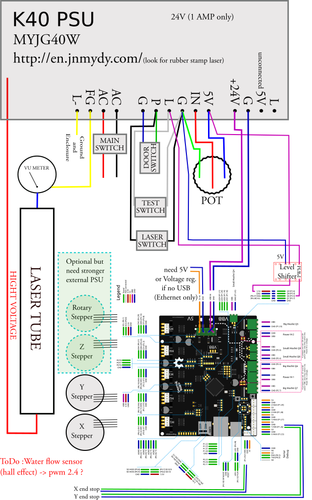
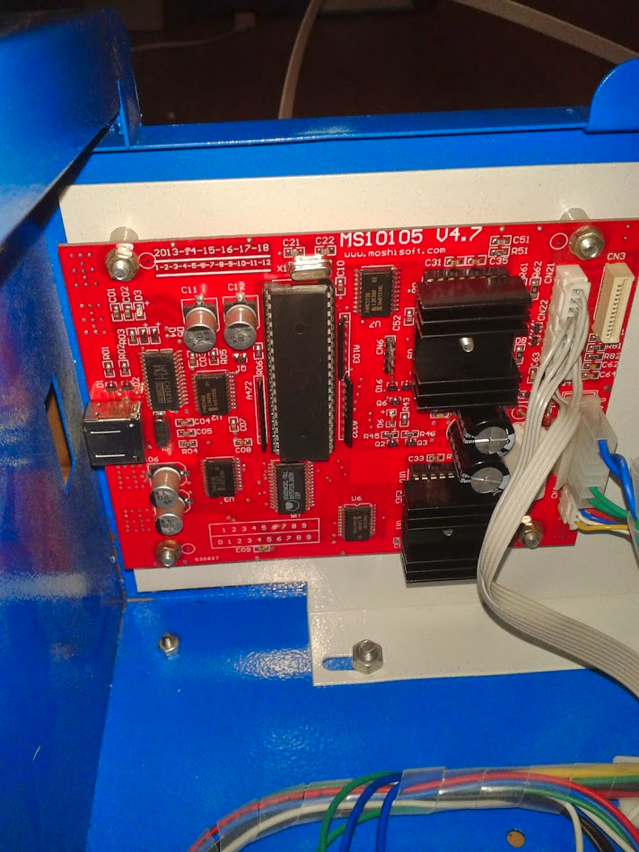
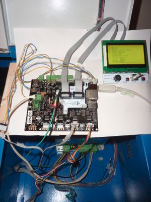
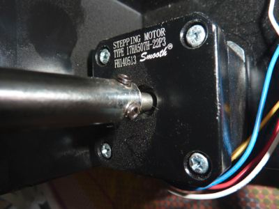
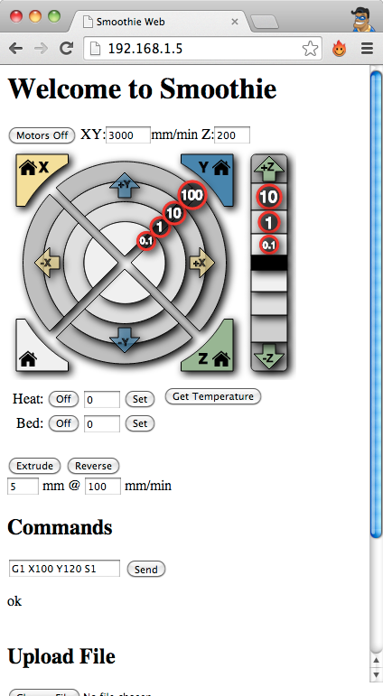

( See also [Smoothiebox Guide](bluebox-guide) )

# SmoothK40 Guide
{::nomarkdown}


{:/nomarkdown}
You want to use proper software to drive your Laser machine, this is the best reason to change for a Smoothie board, and start to use your laser cutter as simply as an inkjet printer.

**Smoothie guide for K40**
by Stephane BUISSON (Oct/Nov 2015)

Before you get started you should have a look into your laser power supply.
There are different models and types out there and the wiring would vary accordingly.


I will look at 2 common cases:

Laser fire on L or on IN. 

The best way to find out your case is to look at how your original wiring was in the factory state.

To fire the PSU will need to satisfy several conditions, materialized by corresponding connections.
PSU could label them differently ex: (G,P,L,G,IN,5v ), (TH,TL,WP,G,IN.5V ), (K+,K-,etc…)

- Door switch
- Laserswitch
- Test switch (L, fire laser)
- IN (PWM or pot return)

Conditions for a recent PSU (not my case)


Personally, I got a MYJG40W from [jnmydy.com](http://www.jnmydy.com) and I can't find any manual for it. (don't speak Chinese)

But I made it work with this schema:



Connecting end stops and motors:

From the factory, I identified 2 original wirings, very similar. Flat connector (CN3) or cables (CN21 CN22 CN4) doing the same thing.



You need to play with a controller to find out your wiring on the flat cable.
or
CN4 is your X motor (plug directly onto Smoothieboard 4XC alpha motor)
CN21 is your Y motor (plug directly onto Smoothieboard 4XC beta motor)
CN22 is your limit switches (X,Y, shared ground) extension cable to be made for connection onto Smoothieboard 4XC min end switches.
(Blue lines were 24V & Ground, Green lines were Fire laser & Ground)

This is simple and very straightforward. No need to touch the front panel wiring (pot, switches, Vu meter).

Level shifter:
Smoothie board Pin 2.5 on JP 33 is 3.3V you will need a level shifter to 5V (2GBP on eBay),
see schema for wiring.



### LCD

Not compulsory, but handy to have to display your IP (dhcp), to home or jog the head, and print from SD.
Needs its own voltage regulator for readable contrast.
The limited 30 cm cables length for the display make it delicate to install the LCD on the front panel, but it's doable.

### Motors

Identify your motors, and check their specs (max current).
Find the datasheet for your motors and their current max. (K40 is fitted with all sorts of motor ref.)
[Smoothmotor](http://www.smoothmotor.com/Standard-Models/Nema-Stepper-Motor.html)



X Motor (double-sided shaft) 17HA507H-22P3


Y Motor 17HA113Y-22A2 FH140513

And you are ready to implement the Smoothie config file.

## Config

The section you want to update are:

- Motors max current
- Laser fire on the right PIN (PWM, could be inverted with `!`)
- Activate laser on the right PIN (equivalent to laser switch, and if applicable to your PSU, digital not PWM)
- Steps per mm accordingly to your measurements (I suggest doing several straight lines, measure them with caliper and make average (for precision reading) for X &Y)
- Network following your specs.

In my case:
Changes in config are:

- Alpha & beta steps per mm (157.575)
- Max stepper current (0.6 & 0.5)
- Laser (module enable true, pin2.5! inverted)
- LCD (true)
- Network (enable true, added line for network hostname SmoothK40)

```markdown
# Arm solution configuration: Cartesian robot. Translates mm positions into stepper positions
alpha_steps_per_mm                           157.575               # Steps per mm for alpha stepper (based on my measurements)
beta_steps_per_mm                            157.575               # Steps per mm for beta stepper
gamma_steps_per_mm                           1600                  # Steps per mm for gamma stepper
```

```markdown
# Stepper module pins (ports, and pin numbers, appending "!" to the number will invert a pin)
alpha_step_pin                               2.0                   # Pin for alpha stepper step signal
alpha_dir_pin                                0.5!                  # Pin for alpha stepper direction (inverted with `!`)
alpha_en_pin                                 0.4                   # Pin for alpha enable pin
alpha_current                                0.6                   # X stepper motor current
alpha_max_rate                               30000.0               # mm/min

beta_step_pin                                2.1                   # Pin for beta stepper step signal
beta_dir_pin                                 0.11                  # Pin for beta stepper direction
beta_en_pin                                  0.10                  # Pin for beta enable
beta_current                                 0.5                   # Y stepper motor current
beta_max_rate                                30000.0               # mm/min
```

...

```markdown
# Laser module configuration
laser_module_enable                          true                  # Whether to activate the laser module at all. All configuration is
                                                                  # ignored if false.
laser_module_pin                             2.5!                  # this pin (connect to PSU IN) PWM to control the laser. Only P2.0 - P2.5, P1.18, P1.20, P1.21, P1.23, P1.24, P1.26, P3.25, P3.26
                                                                  # can be used since laser requires hardware PWM
laser_module_max_power                       0.8                   # this is the maximum duty cycle that will be applied to the laser (Potentiometer like)
laser_module_tickle_power                    0.0                   # this duty cycle will be used for travel moves to keep the laser
                                                                  # active without actually burning
laser_module_pwm_period                      20                    # this sets the pwm frequency as the period in microseconds
```

```markdown
# Network settings
network.enable                               true                  # enable the ethernet network services
network.webserver.enable                     true                  # enable the webserver
network.telnet.enable                        true                  # enable the telnet server
network.ip_address                           auto                  # use dhcp to get ip address
network.hostname                             SmoothK40             # Some DHCP servers accept a hostname for the machine, allowing you to connect with hostname instead of IP
# uncomment the 3 below to manually setup ip address
#network.ip_address                           192.168.3.222         # the IP address
#network.ip_mask                              255.255.255.0         # the ip mask
#network.ip_gateway                           192.168.3.1           # the gateway address
#network.mac_override                         xx.xx.xx.xx.xx.xx     # override the mac address, only do this if you have a conflict
```



Command: tracing (G1) a line from your actual position to (X100, Y100) full laser power (`S1`)

# Software

## VisiCut (Ethernet only with beta version 1.7.290 sept 2015)

Download the latest (Smoothie tab for dev. version) [Visicut Download](http://hci.rwth-aachen.de/visicut-download)

Select menu Option, manage laser cutter, choose smoothie, fill your settings in. You are done ;-))


## Fusion 360

Works with Smoothie in USB.
Free for non-professional use.

Join and comments on the G+ K40 User's community
[K40 User's Community](https://plus.google.com/u/0/communities/118113483589382049502)

Thank you for reading.
