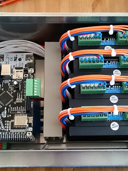

<iframe src="https://player.vimeo.com/video/517828544" width="640" height="360" frameborder="0" allow="autoplay; fullscreen; picture-in-picture" allowfullscreen></iframe>
[Rotary Delta 3D printer](https://vimeo.com/517828544) from [Eric Powell](https://vimeo.com/user134707031) on [Vimeo](https://vimeo.com).

Smoothieboard driving a rotary delta machine, by [Eric Powell](https://forum.makerforums.info/t/homing-problem-using-smoothieware-on-rotary-delta/82556/10), March 2021

<iframe width="560" height="315" src="https://www.youtube.com/embed/AKgKzSsWntw" frameborder="0" allowfullscreen></iframe>
Smoothieboard driving a Hot wire Foam cutter, By Karlo Terrazas May 2017

{::nomarkdown}

{:/nomarkdown}
Laser engraving with LaserWeb and Smoothieboard, by Ariel Yahni, February 2016
<iframe width="560" height="315" src="https://www.youtube.com/embed/0ZMn9tS2_II" frameborder="0" allowfullscreen></iframe>
Smoothieboard driving a plasma cutter, by Peter Van Der Walt, January 2016

[Protovoltaics Pick and place machine](https://hackaday.io/project/5200-pick-and-place-machine) with Smoothieboard, September 2015

<iframe width="560" height="315" src="https://www.youtube.com/embed/sU87nVbK5aM" frameborder="0" allowfullscreen></iframe>
Smoothieboard driving a seeding machine, seeder, April 2015

<iframe width="560" height="315" src="https://www.youtube.com/embed/hXz5ngGVCFI" frameborder="0" allowfullscreen></iframe>
Smoothieboard driving a chinese laser cutter, February 2015

<iframe width="560" height="315" src="https://www.youtube.com/embed/zM838mYFjcA" frameborder="0" allowfullscreen></iframe>
Smoothieboard driving a 400W AC Servomotor by Bouni, January 2015

SmoothieBox ( [Github](https://github.com/llegoff/CNC) ), by Laurent Le Goff, September 2014

<iframe width="560" height="315" src="https://www.youtube.com/embed/9N3meNQKY68" frameborder="0" allowfullscreen></iframe>
Smoothieboard drawing on a H-bot, by Martin Bondéus, July 2014

<iframe width="560" height="315" src="https://www.youtube.com/embed/zJleRVHyuiA" frameborder="0" allowfullscreen></iframe>
Smoothieboard driving a Reprap Morgan with the new Scara arm solution, by Quentin Harley, July 2014

<iframe width="560" height="315" src="https://www.youtube.com/embed/U_qct8ecnas" frameborder="0" allowfullscreen></iframe>
Smoothieboard on delta at high speed, by crunch, June 2014

<iframe width="560" height="315" src="https://www.youtube.com/embed/T5VuvA8wUlA" frameborder="0" allowfullscreen></iframe>
Smoothieboard on delta drawing circles, after autocalibration, by Emmanuel Robert, June 2014

Smoothie doing dual extrusion on a delta by Gestalt73, May 2014

Breadboard Smoothie on ShapeOko, by impure_hate, March 2014

Smoothieboard laser cutting/engraving, by Jason Harper, March 2014 [pictures](https://www.icloud.com/photostream/fr-fr/#A9JtdOXmJtrzH4) [video](https://www.youtube.com/watch?v=V8y1WM676pY)

<iframe width="560" height="315" src="https://www.youtube.com/embed/f0i8ogvhrbI" frameborder="0" allowfullscreen></iframe>
Smoothieboard engraving PCBs, by Jim Morris, February 2014

<iframe width="560" height="315" src="https://www.youtube.com/embed/DmiJD-1SM_k" frameborder="0" allowfullscreen></iframe>
Smoothieboard cutting Aluminium flywheel, by David Bozec, October 2013

Laser fun, by trimpot, June 2013

<iframe width="560" height="315" src="https://www.youtube.com/embed/RCwp8xqrWIc" frameborder="0" allowfullscreen></iframe>
Sunbeam 2.0 ( smoothieboard-like board, running Smoothie ) first steps, Wulfnor, June 2013

<iframe width="560" height="315" src="https://www.youtube.com/embed/zzp227-RWws" frameborder="0" allowfullscreen></iframe>
Smoothieboard controlling un Up! 3D printer, thejollygrimreaper, June 2013

<iframe width="560" height="315" src="https://www.youtube.com/embed/0vkJehKwK3w" frameborder="0" allowfullscreen></iframe>
Feather robot beta, testing feather arm solution, jeffrey ([Lobo CNC](http://lobocnc.com)), May 2013

<iframe width="560" height="315" src="https://www.youtube.com/embed/YV8mXkf_uco" frameborder="0" allowfullscreen></iframe>
Everyday printing speeds with Smoothieboard, by Triffid_Hunter, May 2013

Beta touchprobe code results, powertomato, May 2013

<iframe width="560" height="315" src="https://www.youtube.com/embed/aTN9iEur9dk" frameborder="0" allowfullscreen></iframe>
Smoothieboard cutting aluminium on a 6040 router, Arthur, May 2013
{::nomarkdown}
!

{:/nomarkdown}
«A smoothieboard in the wild», by Morbo, April 2013

<iframe width="560" height="315" src="https://www.youtube.com/embed/_EWfmcWAz-M" frameborder="0" allowfullscreen></iframe>
Smoothieboard printing on a hbot-type printer, Wulfnor, March 2013

<iframe width="560" height="315" src="https://www.youtube.com/embed/rF_y-lMHYr0" frameborder="0" allowfullscreen></iframe>
Smoothieboard running a hbot-type printer, Wulfnor, March 2013

Crowded [Smoothie on a Breadboard](http://smoothieware.org/smoothie-on-a-breadboard) setup by wolfmanjm, March 2013

<iframe width="560" height="315" src="https://www.youtube.com/embed/cTgQ8jODdlg" frameborder="0" allow="accelerometer; autoplay; clipboard-write; encrypted-media; gyroscope; picture-in-picture" allowfullscreen></iframe>
Smoothieboard running a rostock-type printer, os1r1s, February 2013

<iframe width="560" height="315" src="https://www.youtube.com/embed/BdMXtwH7p5Y" frameborder="0" allow="accelerometer; autoplay; clipboard-write; encrypted-media; gyroscope; picture-in-picture" allowfullscreen></iframe>
Smoothieboard running a rostock-type printer, wolfmanjm, February 2013

<iframe width="560" height="315" src="https://www.youtube.com/embed/v2scinnSLmA" frameborder="0" allow="accelerometer; autoplay; clipboard-write; encrypted-media; gyroscope; picture-in-picture" allowfullscreen></iframe>
SmoothieBoard printing on a Prusa by Wulfnor, February 2013

Smoothieboard on a Kossel, by merkur2k, January 2013

<iframe width="560" height="315" src="https://www.youtube.com/embed/wksLdtMm6Ko" frameborder="0" allow="accelerometer; autoplay; clipboard-write; encrypted-media; gyroscope; picture-in-picture" allowfullscreen></iframe>
SmoothieBoard high speed test by Triffid_Hunter, January 2013

<iframe width="560" height="315" src="https://www.youtube.com/embed/t4fWaFVlt8M" frameborder="0" allow="accelerometer; autoplay; clipboard-write; encrypted-media; gyroscope; picture-in-picture" allowfullscreen></iframe>
SmoothieBoard high speed test by Chris Cecil ( [RoboSprout](http://www.robosprout.com/) ), January 2013
