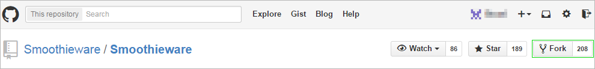
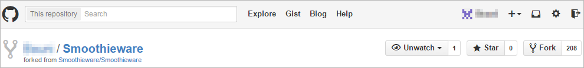
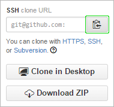
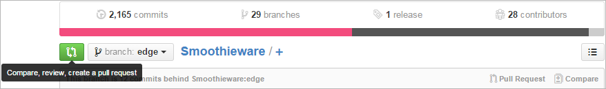
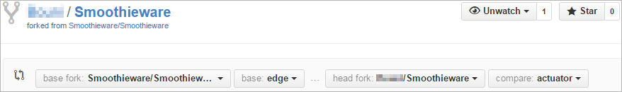



# How to submit a pull request to the Smoothieware Github project

> [!NOTE]
> We use edge as our stable branch (master is no longer maintained). We do not have an unstable branch, so this is why we only allow very well tested PRs into edge.

## Fork the original repository

Create a Fork in your GitHub of [Smoothieware repository](https://github.com/Smoothieware/Smoothieware.git) by clicking the Fork button.

You will now have a forked repository in your list of repositories.

## Clone the forked repository

You can get the URL for cloning that repository by clicking the copy URL button.

On your local workstation clone the repository: `git clone <your GitHub fork of Smoothie>`

## Create a new branch for your bugfix / feature

Create a fix branch with a descriptive name: `git checkout -b fix/some-error`

> [!IMPORTANT]
> **NOTE only one feature/bug fix per branch please**

Edit the file to fix the error.

> [!WARNING]
> **Please**
> - Check the fix!!!
> - Make sure your changes are coincide with our [coding standards](http://smoothieware.org/coding-standards)! (use 4 spaces per indent and not tabs, etc.)

## Commit your changes and push it back on GitHub

Commit the changes: `git commit -am 'introduced lots of bugs'`

Push the branch to your GitHub: `git push origin fix/some-error`

## Submit your pull request

In GitHub, there should be a button that says pull request for that branch, click it.

Select edge as the destination branch, add comments.

> [!WARNING]
> **Please**
> - Check the Files Changed Tab in GitHub to make sure only the files you want to change are listed.
> - Check that only the lines you want changed are changed.

Finally, submit the pull request.

## Want to learn Git?

Try [this game](http://pcottle.github.io/learnGitBranching/).
