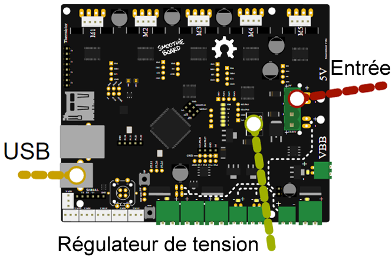

## Logic Power Inputs

{::nomarkdown}

{:/nomarkdown}

There are different ways of providing logic power to your board.

Your board needs two sorts of power to work:

- **12-24V power** to turn motors, heat hotends, etc.
- **5V (or "logic") power** to power the microcontroller (the brain)

## Three Ways to Provide 5V Power

There are three ways to provide 5V power to the board:

1. **Via USB cable** - USB cables provide 5V directly

2. **Via voltage regulator** - By soldering a [voltage regulator](voltageregulator) to the board (and providing 12+24V, which the voltage regulator then turns into 5V)

3. **Direct 5V input** - By providing 5V directly to the 5V power input (next to the VBB power input)

## Simplest Solution

If you want to keep it simple, the easiest solution is just to connect your Smoothieboard to your computer via USB.

## Multiple Power Supplies

Note you can connect several different power supplies at the same time, with no issue at all.

Smoothieboard has diodes on-board that will simply get the power from the one with the highest voltage, meaning you can even turn one off and the other will be used without a reset.

## Understanding Voltage and Current

If voltage and current are strange concepts to you, it's probably a good idea before you continue setting up your board, that you read [this introduction](https://learn.sparkfun.com/tutorials/voltage-current-resistance-and-ohms-law).

## Power Consumption

The board's logic circuits (5V line) typically consume up to 500mA current (what is standard for a USB port).
