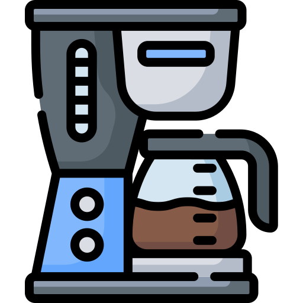
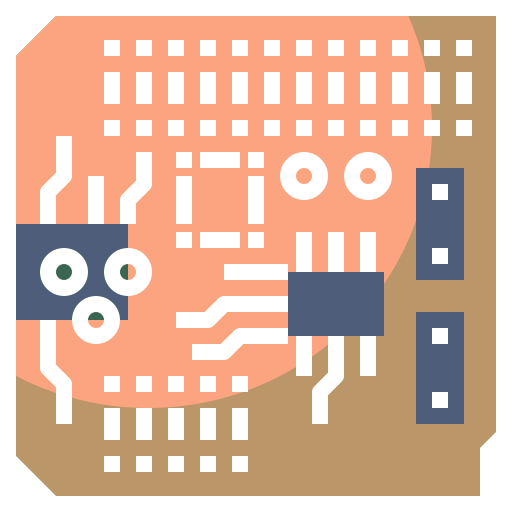
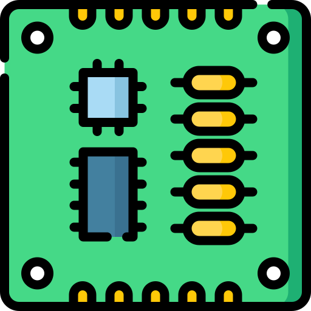

# Menu Icons Reference

<sl-alert variant="warning" open>
  <sl-icon slot="icon" name="exclamation-triangle"></sl-icon>
  <strong>Internal Page:</strong> This page is just an internal placeholder to work on icons for the top menu. If you got here, you probably took a wrong turn somewhere. Thanks for using the project and reading the documentation!
</sl-alert>

---

## Social Media Icons (24px)

{::nomarkdown}

  
  
  
  
  
  
  
  
  
  
  
  
  
  
  

{:/nomarkdown}

---

## Navigation Icons (40px)

{::nomarkdown}

  

    
    
Manual

  

  

    
    
Board

  

  

    
    
Circuit

  

  

    
    
PCB

  

  

    
    
Gallery

  

  

    
    
Volunteer

  

  

    
    
Search

  

{:/nomarkdown}

---

## Navigation Icons (64px)

{::nomarkdown}

  

    
    
Manual

  

  

    
    
Board

  

  

    
    
Circuit

  

  

    
    
PCB

  

  

    
    
Gallery

  

  

    
    
Volunteer

  

  

    
    
Search

  

{:/nomarkdown}

---

## Navigation

Return to the [documentation homepage](index).
