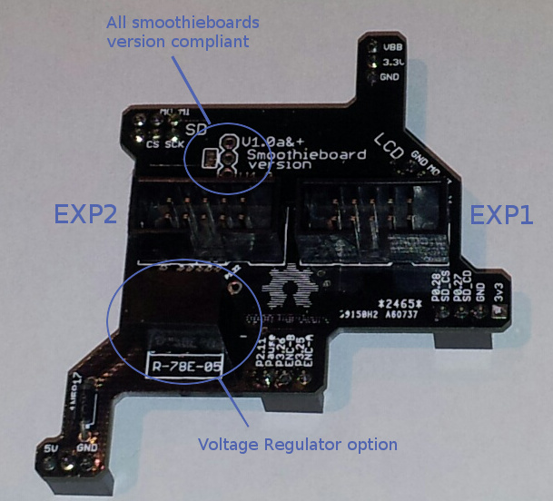
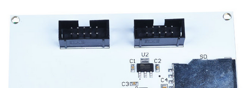
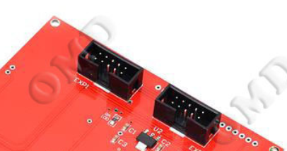
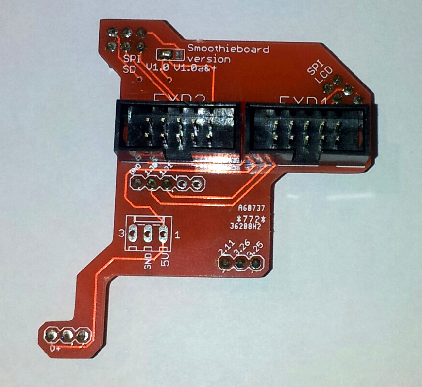

# RRD GLCD Adapter board

This adapter allows you to connect a [Reprapdiscount GLCD panel](http://smoothieware.org/panel) to a Smoothieboard easily.



All of the panel's functionalities are available:

- Display
- Encoder selector
- Button
- Buzzer
- SD card

## Open Hardware

The Source is on [GitHub](https://github.com/llegoff/GlcdAdapter2)

## Getting one

You can now get a RRDGLCD Adapter [here](http://robotseed.com).
For US another version coming soon [here](http://shop.uberclock.com)

> [!NOTE]
> Both versions look a bit different, but are functionally identical and are used the same way. The RobotSeed version is pictured here, but the instructions are identical for the Uberclock version.

## Assembly

Place the 3-pin connectors below the PCB


And solder


Mount the EXP1 & EXP2 connectors, and solder




On some RRDGLCD the connector are reversed




## Power supply

If Smoothieboard has a good 5V regulator, or a 5V power supply, the panel of the power supply can be drawn from this one by means of a diode (ex 1N5817).


If not, please install a voltage regulator Recom 785.0-1


The diode and regulator may be mounted at the same time.

## Configuration

The adapter is configured for Smoothieboard v1.0a and newer.

For v1.0 Smoothieboard, configure the PCB


Cut the jumper track, and drop a welding goute on the other part of the jumper.

## Use

Solder the connector missing


Update firmware (version after October 2014), see [Flashing Smoothie firmware](flashing-smoothie-firmware)
Edit the config file on the µSD:

```markdown
# config settings
panel.enable                          true              # set to true to enable the panel code
panel.lcd                             reprap_discount_glcd     # set type of panel
panel.spi_channel                     0                 # spi channel to use  ; GLCD EXP1 Pins 3,5 (MOSI, SCLK)
panel.spi_cs_pin                      0.16              # spi chip select     ; GLCD EXP1 Pin 4
panel.encoder_a_pin                   3.25!^            # encoder pin         ; GLCD EXP2 Pin 3
panel.encoder_b_pin                   3.26!^            # encoder pin         ; GLCD EXP2 Pin 5
panel.click_button_pin                1.30!^            # click button        ; GLCD EXP1 Pin 2
panel.buzz_pin                        1.31              # pin for buzzer      ; GLCD EXP1 Pin 1
panel.back_button_pin                 2.11!^            # 2.11 menu back      ; GLCD EXP2 Pin 8
# setup for external sd card on the GLCD which uses the onboard sdcard SPI port
panel.external_sd                     true              # set to true if there is an extrernal sdcard on the panel
panel.external_sd.spi_channel         1                 # set spi channel the sdcard is on
panel.external_sd.spi_cs_pin          0.28              # set spi chip select for the sdcard (or any spare pin)
panel.external_sd.sdcd_pin            0.27!^            # sd detect signal (set to nc if no sdcard detect) (or any spare pin)
```

If you do not want to use the buzzer, leaving out the `panel.buzz_pin` line will leave the pin floating. As there is no pull-down on the buzzer, it will keep buzzing. To avoid this, you can either solder a pull-down resistor on the adapter board or you can use this little hack:

```markdown
switch.nonoise.enable                        true
switch.nonoise.output_pin                    1.31v
switch.nonoise.output_type                   digital
```

This will create a pseudo-switch that does nothing, but it will enable the pull-down on the pin. You have to leave out the `panel.buzz_pin` line.



The V1 of this adapter was not capable of accessing the panel's SD card slot.

This functionality can be made available on the v1 by cutting track on PCB


And soldering a cable under the PCB


