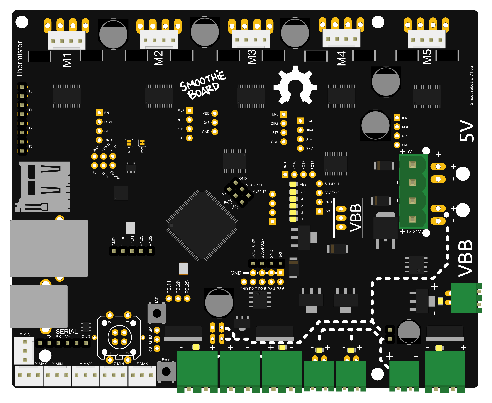

# Smoothieboards

The Smoothieboards are numerical fabrication controllers designed to run the Open-Source [Smoothieware](http://smoothieware.org) firmware, by a community of volunteers.

They come into a range of different versions, with different feature sets and advantages.

All Smoothieboards are designed to run on the most powerful hardware in their price range at the time of their conception, to be easy to expand for new and adventurous uses, to be easy to develop on, and to be simple to use for normal users.

This page lists the different boards, you can find more information in each Smoothieboard's dedicated page:

---

## `v1`

Smoothieboard v1 has been the first released Smoothieboard and has received several updates.

It has gone from an experimental project to a widely used and acclaimed system.

It features:

- 32-bit [Cortex-M3 LPC1769](http://www.nxp.com/products/microcontrollers-and-processors/arm-processors/lpc-cortex-m-mcus/lpc-cortex-m3/lpc1700-cortex-m3/512kb-flash-64kb-sram-ethernet-usb-lqfp100-package:LPC1769FBD100) with 512kB flash and 64kB RAM
- 3 to 5 [A5984](http://www.allegromicro.com/en/Products/Motor-Driver-And-Interface-ICs/Bipolar-Stepper-Motor-Drivers/A5984.aspx) stepper drivers with 1/32 microstepping
- Thermistors and mosfets to control heaters and fans
- Ethernet and USB connections
- SD card to store configuration and Gcode files
- Various inputs and outputs for extensibility
- Much more

The board comes in 3 versions, 3X, 4X and 5X, with different sets of peripherals each.

 
More information on the [Smoothieboard v1 page](http://smoothieware.org/smoothieboard-v1)

---

## `v2`

The successor of the v1 board in the version 2 line of Smoothieboards.

It will feature:

- 32-bit [Cortex-M4 LPC4330](http://www.nxp.com/products/microcontrollers-and-processors/arm-processors/lpc-cortex-m-mcus/lpc-cortex-m4/lpc4300-cortex-m4-m0/32-bit-arm-cortex-m4-m0-mcu-up-to-1-mb-flash-and-136-kb-sram-ethernet-two-high-speed-usb-lcd-emc:LPC4337FET256) with 8MB of flash, 264kB of RAM, and a M0 co-processor
- 4 [TMC2660](http://www.trinamic.com/products/integrated-circuits/details/tmc2660-pa/) stepper drivers with 1/256 microstepping
- Thermistors and mosfets to control heaters and fans
- Ethernet, USB-B (to computer) and USB-A (to thumb drive) connections
- SD card with fast access
- Standard expansion ports with a [series of plug-and-play boards](https://docs.google.com/document/d/1PKwoEB4zZQWxT4tJm48W-1_lBEOAGzk7noKMVmRszs4/edit?usp=sharing)
- Much more

Currently being designed, see [here](http://smoothieware.org/blog_15).

Because v2 is being developed by awesome volunteers, we have no timetable or planned release date, so please stop asking.

---

## `v2-mini`

A minimalistic version of the v2 board, designed to be as inexpensive as possible.

It's essentially just enough to run a 3D printer with no heated bed, a small laser cutter or a CNC router, while still giving you the v2 experience. No extra goodies.

It will feature:

- 32-bit [Cortex-M4 LPC4330](http://www.nxp.com/products/microcontrollers-and-processors/arm-processors/lpc-cortex-m-mcus/lpc-cortex-m4/lpc4300-cortex-m4-m0/32-bit-arm-cortex-m4-m0-mcu-up-to-1-mb-flash-and-136-kb-sram-ethernet-two-high-speed-usb-lcd-emc:LPC4337FET256) with 8MB of flash, 264kB of RAM, and a M0 co-processor
- 4 Heroic drivers with 1/128 microstepping
- Thermistors and mosfets to control heaters and fans
- USB-B (to computer)
- SD card with fast access
- Standard expansion ports with a [series of plug-and-play boards](https://docs.google.com/document/d/1PKwoEB4zZQWxT4tJm48W-1_lBEOAGzk7noKMVmRszs4/edit?usp=sharing)
- Not much more
- You have to solder the connectors yourself

Currently being designed, see [here](http://smoothieware.org/blog_15).

 
Because v2 is being developed by awesome volunteers, we have no timetable or planned release date, so please stop asking

---

## `v2-pro`

An overpowered version of v2, for experimenting with intergalactic features and use on high-end machines.

It will feature:

- 32-bit [Cortex-M4 LPC4330](http://www.nxp.com/products/microcontrollers-and-processors/arm-processors/lpc-cortex-m-mcus/lpc-cortex-m4/lpc4300-cortex-m4-m0/32-bit-arm-cortex-m4-m0-mcu-up-to-1-mb-flash-and-136-kb-sram-ethernet-two-high-speed-usb-lcd-emc:LPC4337FET256) with 8MB of flash, 264kB of RAM, and a M0 co-processor
- A FPGA to handle step generation at insane rates and new features
- 3 [TMC262](http://15006.dcpserver.de/download.php?file=_articles/products/integrated-circuits/tmc262/_datasheet/TMC262_datasheet.pdf) (high power) and 2 [TMC2660](http://www.trinamic.com/products/integrated-circuits/details/tmc2660-pa/) stepper motor drivers with 1/256 microstepping
- Many thermistors and mosfets to control heaters and fans
- Ethernet, USB-B (to computer) and USB-A (to thumb drive) connections
- SD card with fast access
- Many standard expansion ports with a [series of plug-and-play boards](https://docs.google.com/document/d/1PKwoEB4zZQWxT4tJm48W-1_lBEOAGzk7noKMVmRszs4/edit?usp=sharing)
- Much more

Currently being designed, see [here](http://smoothieware.org/blog_15).

Because v2 is being developed by awesome volunteers, we have no timetable or planned release date, so please stop asking.

---
