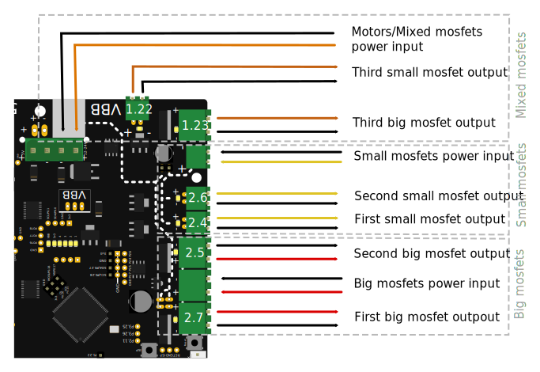

# Spindle control with a Mosfet

If you are not using a VFD, and your spindle motor is a DC motor of low enough power (voltage and current, **including** any current extremes when stalled), you can control it directly using the MOSFETs on the Smoothieboard.

MOSFETs are present on-board, but have limited current capacity (up to 12A) and need to be protected by a 'flyback' diode when controlling a motor, electromechanical relay or other inductive load. See [Wikipedia Flyback_diode](https://en.wikipedia.org/wiki/Flyback_diode) and [Driving inductive load, Electronics StackExchange](https://electronics.stackexchange.com/questions/358210/driving-inductive-load-from-ic-with-mosfet).

Motors have the property of inductance, which is the electrical equivalent of inertia. The motor current will continue to flow after the MOSFET is switched off, because the energy stored in the inductor by the current does not instantly disappear. The current will decrease as the stored energy is dissipated. This current flow results in the voltage across the motor reversing and increasing (or "spiking") until the current finds a path to flow.

An appropriately connected 'flyback' diode with sufficient voltage and current ratings will provide a safe, **intended** path for the motor current.

Without a diode, when the MOSFET turns off the motor voltage will spike up until the current finds an **unintended** path. Typically this degrades or immediately destroys the MOSFET and perhaps other circuitry such as that driving the MOSFET gate.

Connect the diode in reverse across the motor (when the MOSFET is on, it must **NOT** cause power to flow through the diode). Connect the anode ('arrow') to the MOSFET Drain terminal and the cathode ('bar', often marked by a line on the package) to the motor power supply. The diode rating should be rated with Voltage exceeding the maximum expected supply voltage by at least 20% (usually low cost to get a higher voltage rating), and (conservatively) Current at least equal to half the motor current (the current through the diode will not be continuous). An example part number is 6A4-T, rated 6A and 400V, under $1 USD.

The same considerations apply to other inductive loads such as solenoid valves and relay coils.

[Solid state relays](general-appendixes.md#solidstaterelay) are controlled via a GPIO pin, and can control higher loads, but are on/off only (no control of the exact amount of power sent via PWM). For more information about SSRs, [see this appendix](general-appendixes.md#solidstaterelay).

> [!WARNING]
> It is critical that you add a diode across your motor if you are going to control it with a Smoothieboard. If you do not do this, you are absolutely guaranteed to destroy the MOSFET, and possibly the Smoothieboard.

Here is a brief on the MOSFETs on the Smoothieboard:


*Note: a mosfet cannot provide power if it is not provided power via an input.*

## MOSFETs



In order to configure your Smoothieboard to use a specific MOSFET, you need to know which pin corresponds to which MOSFET. Here is a recapitulating table to help you find that out:



## Wiring

TODO: diagram

## Configuration

Now that you have located which MOSFET you are going to use for Spindle control, and what GPIO pin it corresponds to, you need to add a spindle control section to your configuration file.

We will be doing this using the [Switch](switch.md) module.

Add this to your configuration file:

```markdown
# Spindle control Switch module
switch.spindle.enable                            true             #
switch.spindle.input_on_command                  M3               #
switch.spindle.input_off_command                 M5               #
switch.spindle.output_pin                        2.7              # Here we are using the first big MOSFET
switch.spindle.output_type                       pwm              # pwm output settable with S parameter in the input_on_command
switch.spindle.max_pwm                           255              # set max pwm for the pin default is 255
```

## Controlling the Spindle

Now that everything is configured, you can use G-codes to control the Spindle.

You can do this either manually by sending G-codes directly to the board via serial or your host software, or add those G-codes to the beginning/end.

You can choose the exact G-codes in the configuration, here we used the standard `M3` to turn the Spindle ON, and `M5` to turn the Spindle OFF.

If you need to choose the power (speed) of your Spindle, you can do so because the output is configured as PWM.

Simply do:

```markdown
M3 S128
```

To set the spindle to half power/speed. PWM values go from 0 to 255.

0 means no power to the spindle, and 255 means full power to the spindle.

## Diode

Because the spindle can feed power back into the MOSFET and damage the MOSFET, you also need to wire a diode of sufficient size across the output. See notes in the first section above.

# PID loopback spindle control

To get more accurate RPM control, you can use a feedback sensor. This can be optical or a hall effect sensor, which senses the rotation of the spindle. Smoothie then measures the real RPM of the spindle and adjusts the PWM value accordingly.

To use this module, you need to connect your spindle to pins with proper hardware support:
* PWM output pin: any of P1.18, P1.20, P1.21, P1.23, P1.24, P1.26, P2.0 - P2.5, P2.26, P3.25
* Feedback sensor pin: must be in port 0 or port 2; P2.6 and P2.7 are available on smoothieboard

## Configuration

| Option | Example value | Explanation |
| ------ | ------------- | ----------- |


## G-code

Available G-code commands:
* `M3` will start the spindle. `M3 S5000` will start the spindle and set speed to 5000 RPM.
* `M5` will stop the spindle. Last set RPM is remembered and used for next `M3` command if S argument is not given.
* `M957` will report the current spindle speed and PWM value.
* `M958` will report the current PID parameters. `M958 Px.xxx Ix.xxx Dx.xxx` will set them (to save the new values, you need to edit config file manually).

## Tuning the PID parameters

There is no PID autotuning for spindle parameters currently. You can use the following process to manually tune the PID:

1. Set dummy values with `M958 P0.0001 I0 D0`
2. Stop the spindle with `M5` and make sure spindle is ready to run on next `M3` command (i.e. power supply is on).
3. Run `M3 S100000`, which should start the spindle at maximum speed.
4. Measure the time **T** it takes for the spindle to reach full speed (using your ears and a stopwatch).
5. Check the maximum RPM **R** the spindle reaches by running `M957`

Now set the parameters to:
* P = **1/R** (e.g. for 10,000 RPM, set P = 0.0001)
* I = **2/(R*T)** (e.g. if it took 1 second to speed up to 10,000 RPM, set I = 0.0002)
* D = **T / R / 10** (e.g. D = 0.00001)

Some manual tuning may be needed after this. Test speed changes using the `M3` command and try loading the spindle to see if it reacts fast enough to load changes.
