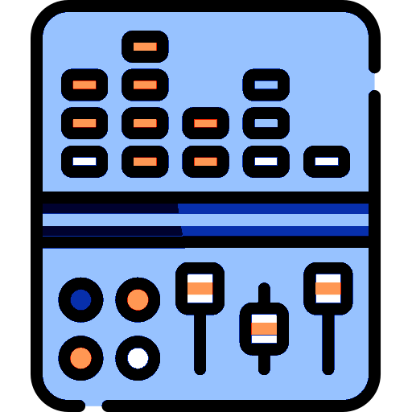
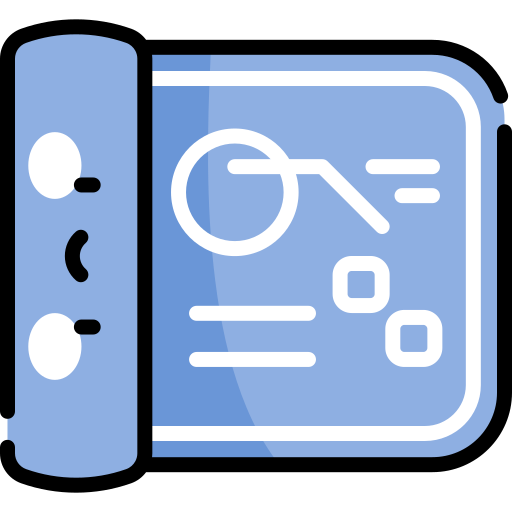

> [!NOTE]
{::nomarkdown}
> 
{:/nomarkdown}
{::nomarkdown}
> 
{:/nomarkdown}
> **Smoothie** is a **[free, opensource, high performance](start)** and modular **G-code** interpreter and **CNC** control system for the powerful **[Smoothieboard](smoothieboard)** 32bits controller. It's designed to be very user-friendly and hacker-friendly. The Source code is on [GitHub](https://github.com/Smoothieware/Smoothieware). ヾ(❀◦◡◦)彡 

> [!WARNING]
{::nomarkdown}
> 
{:/nomarkdown}
> Smoothieboard v2 is now on Kickstarter! Get your board [here](https://www.kickstarter.com/projects/arthurwolf/smoothieboard-v2).

The Smoothie project is always looking for help, whatever your skills are, there are things you can do to improve the project with the other volunteers, if you feel like you could give us some of your free time, please [contact us](mailto:wolf.arthur@gmail.com), **help and working together** is what has made this project so neat, advanced and precious over the years, and is **very welcome**.

 

## Documentation

### Step by step guides

[3D printer guide](3d-printer-guide)

[Laser cutter guide](laser-cutter-guide)

[CNC mill guide](cnc-mill-guide)

There is also a [Pick and Place](pick-and-place) guide.

### Firmware documentation

- [Basics](basics)
- [Communication](communication)
  - [Network](network)
  - [USB](usb)
  - [UART](uart)
  - [Bluetooth](bluetooth-serial)
  - [Wifi](wifi) (new)
- 
  - [Configuring Smoothie](configuring-smoothie): Configuration and use, by module
  - [List of all configuration options](configuration-options)
  - [Motion control](motion-control): All things related to gcode interpolation, motion and acceleration planning, and step generation
    - [Arm Solutions](Arm-Solutions): [Cartesian](Cartesian), [Delta](delta), [Hbot](Hbot), [Core-XY](Core-XY), [Rotary Delta](Rotary-Delta), [Morgan Scara](morgan-scara)
    - [6axis](6axis): Using A, B and C axes, for 4, 5 or 6 axis motion.
    - [Grbl mode](grbl-mode): Using Smoothie in CNC-specific mode instead of 3D printing mode
{::nomarkdown}
- !
{:/nomarkdown}
  - [Tools](tools)
    - [Extruder](extruder): Control extruders for 3D printing
    - [Temperaturecontrol](temperaturecontrol): Heat and cool things like hotends and heated beds
    - [Laser](laser): For cutting
    - [Endstops](endstops): For homing
    - [Spindle](spindle-module): Control your spindle motor with G-code
    - [Switch](switch): Quickly create custom G-code ⇆ Input/Output mapping without needing to write a custom module, like to control a fan
    - [TemperatureSwitch](temperatureswitch): Automatically turn/on a device based on a threshold temperature
    - [ZProbe](zprobe): For probing, levelling, and automated calibration
      - [PCB milling](pcb-milling): For PCB milling
    - [Drillingcycles](drillingcycles): Canned drilling cycles support
    - [Filament-detector](filament-detector): Use an encoder to check filament is pushed correctly
  - [Utils](utils)
    - [Player](player): Play files from the SD card
    - [Currentcontrol](currentcontrol): Digitally control your stepper motors current 
    - [AdvancedMotorDriver](advancedmotordriver): For controlling SPI based stepper motor controllers like DRV8711 and TMC26X
    - [Configurator](configurator): Manipulate configuration using console commands
    - [Kill Button](killbutton) and [Play LED](play-led): S/W based kill and play activity LED
    - [Panel](panel): Drive smoothie directly without a host using monochrome lcd screens and click encoders
    - [Smoopi](smoopi): **New** drive Smoothie using a color touch screen on rpi
    - [on_boot.gcode](on_boot.gcode): Execute G-codes every time the board boots
- [Using Smoothie](using-smoothie): General firmware use
  - [Console Commands](console-commands)
  - [Supported G-Codes](supported-g-codes)
  - [Stopping Smoothie](stopping-smoothie)
  - [Software](software)
    - [Pronterface](pronterface)
    - [Octoprint](octoprint)
    - [bCNC](bcnc)
    - [Smoopi](smoopi): **New** drive Smoothie using a color touch screen on rpi
    - [Fusion360](fusion360)
- **[Troubleshooting](troubleshooting)**: It doesn't work (ノo益o)ノ彡┻━┻ ! What to do ∩(︶▽︶)∩.
  - [MRI](mri-debugging): In the very rare case smoothie code crashes
- [Contributing](contributing): We need your help!
  - [Todo](todo): List of the things that are being worked on in the project.
  - [Editing the Wiki](editing-the-wiki): How to edit this documentation and improve it.

> [!NOTE]
{::nomarkdown}
> !
{:/nomarkdown}
> **The firmware.bin file**
> 
> Note, Smoothieboards come completely pre-flashed, you do not need to compile or flash the firmware, unless you want to upgrade to a newer version, or to contribute to the code.
> 
> - [Getting Smoothie](getting-smoothie)
> - [Flashing Smoothie](flashing-smoothie)
> - [Compiling Smoothie](compiling-smoothie)
> - [Setting up a SD-Card](sd-card)
> - [How to file an Issue on Github](https://github.com/smoothieware/smoothieware/blob/edge/issue_template.md)
> - [Flashing the Bootloader](flashing-the-bootloader)

More: [Windows Drivers](Windows-Drivers), [Linux Drivers](Linux-Drivers), [Mac Drivers](Mac-Drivers), [New Features](New-Features), [Gallery](Gallery), [Smoothieboard Beta Guide](smoothieboard-beta-guide)

### Hardware documentation

**Available now**: [SmoothieBoard](smoothieboard), the modular and awesome, smoothie-dedicated CNC controller.

- [Smoothieboards](smoothieboards): all versions of the Smoothieboard hardware
- [Running Smoothie on a Breadboard](smoothie-on-a-breadboard)
- [Pinout](pinout) has diagrams of all pins on the board
- [Pin usage](lpc1769-pin-usage) has information on the use and capability of all pins
- [How to wire](how-to-wire) describes tutorials, tools and best practices for wiring and cabling work when installing your Smoothieboard in a new machine.

[Get a Smoothieboard here](getting-smoothieboard)

## Features

### For users

{::nomarkdown}
!

{:/nomarkdown}
- Powerful (120Mhz, 32bit) [micro-controller](http://www.embeddedartists.com/products/lpcxpresso/lpc1769_xpr.php).
- Easy to use and [configure](configuring-smoothie).
- Smooth, jerk-free motion and enabling higher speeds
- Can be used for CNC milling, laser cutting, and 3D printing.
- [Opensource/hardware all-included controller board](smoothieboard)
- [SD-Card](sd-card) support for configuration and executing G-code.
- Composite USB Mass Storage + Serial interface to host.
- Free [email support (✿◠‿◠)](mailto:wolf.arthur@gmail.com)

### For hackers

{::nomarkdown}
!

{:/nomarkdown}
- Modular, event-driven design, allowing to add functionality easily without modifying the core. See the [ModuleExample](moduleexample)
- Designed to support non-Cartesian machines
- LPC1769 leaves lots of room for additional functionality.
- The mBed [functions](http://mbed.org/handbook/Homepage) and [additional libraries](http://mbed.org/cookbook/Homepage) are available for easy and fast prototyping. But compiles off-line (using GCC), not dependent on the mBed online compiler
- Strict process for acceptance of new code, to keep the project at high quality
- Heavily commented code



### Developer documentation

{::nomarkdown}
!

{:/nomarkdown}
- **[Todo](todo)**: List of the things that are being worked on in the project. We need your help!
- [HowItWorks](howitworks): Walk-through the inner workings of Smoothie (°٢°)
- [ModuleExample](moduleexample): Basics of working with Modules in Smoothie
- [Listofevents](listofevents): List of all Events you can register for
- [Developers-Guide](developers-guide): Information useful to smoothie coders
- [LPC1769 pin usage](lpc1769-pin-usage): Documents all the pins used and which are spare
- [DebuggingSmoothie](debuggingsmoothie): Using the built-in MRI serial debugger
- [Coding-Standards](coding-standards)
- [Contribution Guidelines](contribution-guidlines)
- [Eclipse](eclipse): Using Eclipse IDE to build and debug
- [Github](github): How to submit pull requests for Smoothie
- [Third Party Branches](third-party-branches): a list of useful branches to smoothie that may be helpful to some but are not included in the main branch
- Smoothie developer IRC forum on [IRC](irc) in #smoothiedev @ irc.freenode.net
- [Logo Proposals](logo-proposals)
- Current edge build status: 

## Review

<iframe width="100%" height="400" src="http://www.youtube.com/embed/vsu_vAKvRO0?hd=1" frameborder="0" allowfullscreen></iframe>
